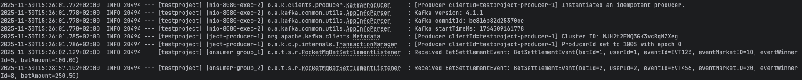
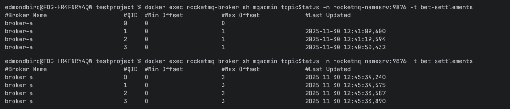

# Spring Boot - Apache Kafka - RocketMQ Project

## Overview

This service demonstrates event publishing and processing using Spring Boot, Apache Kafka, and RocketMQ. It exposes a REST API for publishing sport event outcomes and integrates with messaging systems and a relational database.

## Getting Started

### Prerequisites

- Docker & Docker Compose
- Java 21
- Gradle

### Running the Application

#### 1. In the project root directory, run:   **`docker compose up`**
   
This will start the following services:
- **Zookeeper**: Runs on port 2181 for Kafka coordination.
- **Kafka**: Runs on port 9092 for event streaming, depends on Zookeeper.
- **Kafka-init**: Initializes Kafka topics after Kafka starts.
- **PostgreSQL**: Runs on port 5432, stores bet records.
- **Postgres-init**: Initializes the PostgreSQL database. Adds default records into the DB
- **RocketMQ Namesrv**: Runs on port 9876, provides name service for RocketMQ.
- **RocketMQ Broker**: Runs on ports 10909 and 10911, handles RocketMQ messaging, depends on Namesrv.

#### 2. Start the Spring Boot application: **`./gradlew bootRun`**

## API Reference

### Publish Sport Event Outcome

- **Endpoint**: `POST /sportEvents/publishOutcome`
- **URL**: `http://localhost:8080/sportEvents/publishOutcome`
- **Request Body**:
  ```json
  {
      "eventId": "EVT123",
      "eventName": "eventName1",
      "eventWinnerId": "eventWinnerId1"
  }

Description: Publishes the outcome of a sport event to Kafka and RocketMQ.

## Database
On startup, the application creates a table with the following sample records:

| bet_id | user_id | event_id | event_marketid | eventwinnerid | bet_amount |
|--------|---------|----------|----------------|---------------|------------|
| 1      | 1       | EVT123   | 10             | 5             | 100.00     |
| 2      | 2       | EVT456   | 20             | 8             | 250.50     |
| 3      | 3       | EVT789   | 30             | 12            | 75.25      |
| 4      | 1       | EVT451   | 10             | 18            | 150.50     |
| 5      | 5       | EVT989   | 60             | 12            | 125.25     |

## Screenshots

After a successful application startup and endpoint call, you should be able to see the logs from receiving the events from the rocketMq topic:


RocketMq internal structure:


## Testing

The code doesn't have tests currently, but it would be valuable to include at least unit and component tests.
